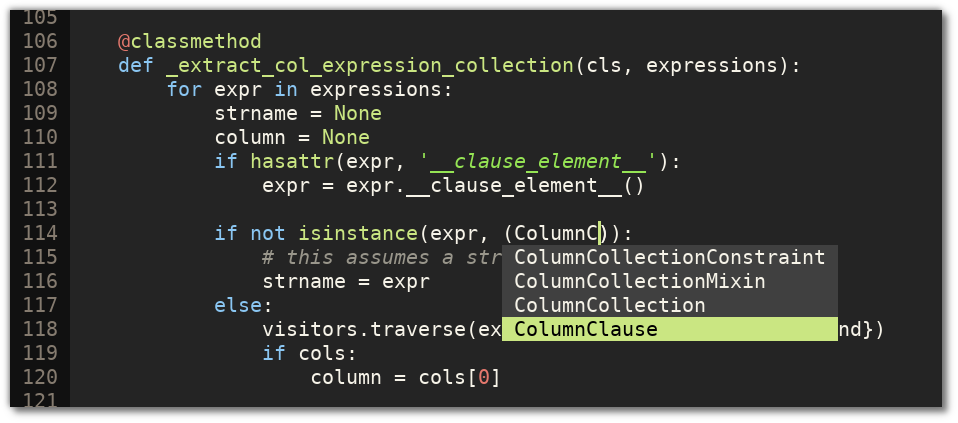
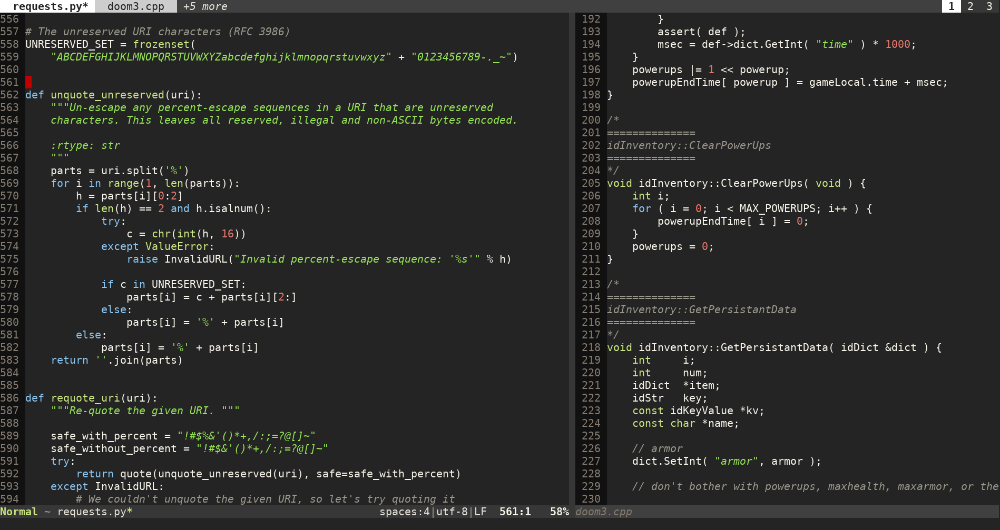
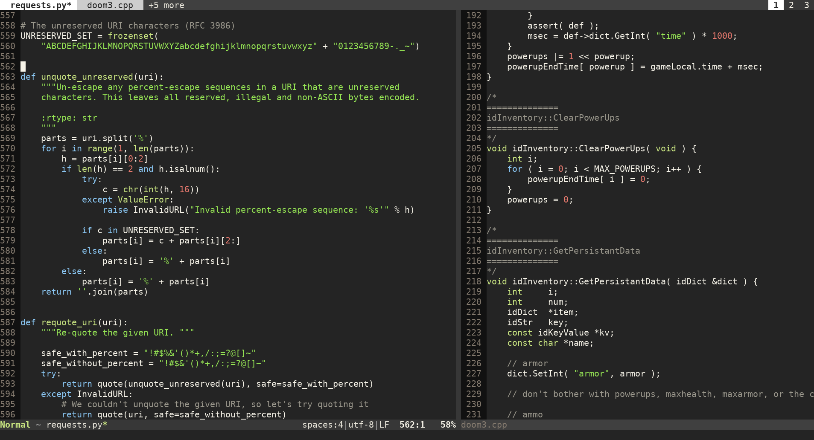
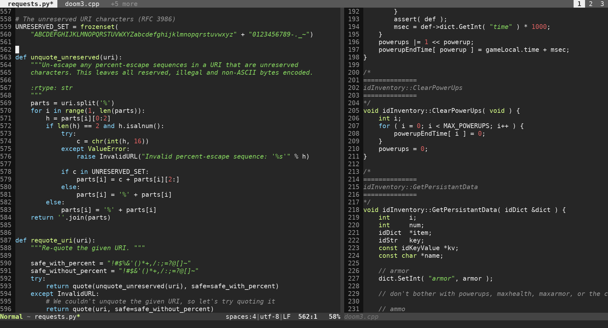
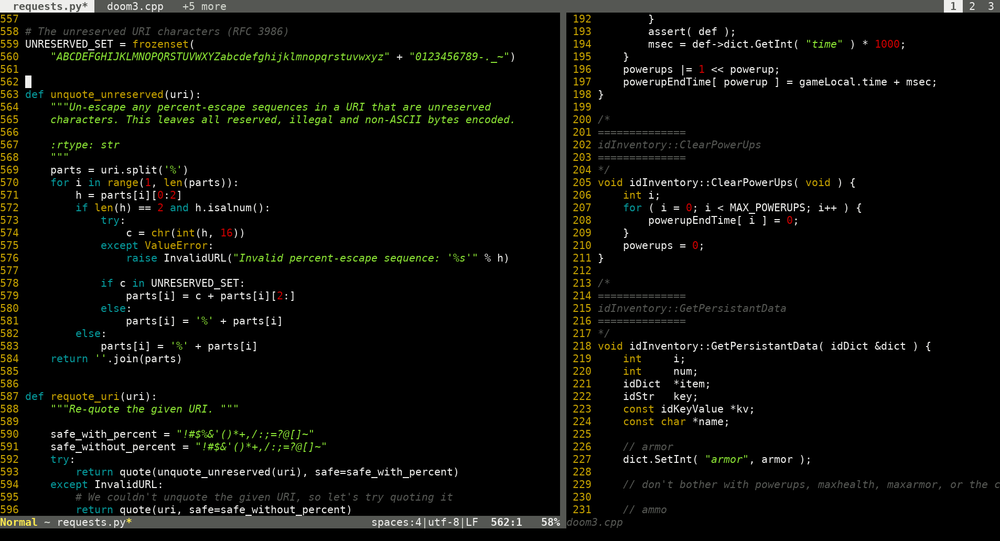

Vem Dark
========

Dark color scheme for Vim.



`vem-dark` is an updated version of *Wombat* by Lars H. Nielsen
(https://dengmao.wordpress.com/2007/01/22/vim-color-scheme-wombat/).

`vem-dark` supports both GVim and terminal Vim with 24bit, 256 and 16 colors.

## Configuration

### Gvim



Once you have installed the plugin, you can activate the new color scheme
in your `.vimrc` file with:
```
syntax enable

" italic fonts are enabled by default in GVim
" if you want to disable them uncomment this line:
" let g:vem_colors_italic = 0

colorscheme vem-dark
```

### 24bit True Color Terminals



With 24bit color support you can display Vim color schemes in the terminal
as they do in graphical Vim.

To use 24bit colors you need a relatively modern terminal and a version of Vim
later or equal to 7.4.1770. Currently, the lastest versions of gnome-terminal,
iTerm2, konsole and xcfe-terminal, among others, support 24bit colors.

To enable it, use:
```
syntax enable
set termguicolors

" italic fonts are disabled by default in terminal because some of them
" don't support them, if you want to enable them uncomment this line:
" let g:vem_colors_italic = 1

colorscheme vem-dark
```

### 256 Color Terminals



You can configure your 256 color terminal to use the color scheme with:
```
syntax enable
set t_Co=256

" italic fonts are disabled by default in terminal because some of them
" don't support them, if you want to enable them uncomment this line:
" let g:vem_colors_italic = 1

colorscheme vem-dark
```
### 16 Color Terminals



You can configure your 16 color terminal to use the color scheme with:
```
syntax enable
set t_Co=16

" italic fonts are disabled by default in terminal because some of them
" don't support them, if you want to enable them uncomment this line:
" let g:vem_colors_italic = 1

colorscheme vem-dark
```
Note that in these terminals the chosen color are defined by the
terminal itself, not by the color scheme. The color palette shown in
this example is know as 'Tango' and it is available in many terminals.

---

**Note**: `vem-dark` is used as the default color scheme of a bigger Vim
configuration setup name Vem -still in the works-. Hence the plugin name. In
any case, this color scheme can be used totally independently from the Vem
project. Other components of the project are:

* [Vem Tabline](https://github.com/pacha/vem-tabline): A plugin to show the
  list of buffers in the tabline.
* [Vem Statusline](https://github.com/pacha/vem-statusline): A light plugin
  to show some useful information in Vim statusline.

